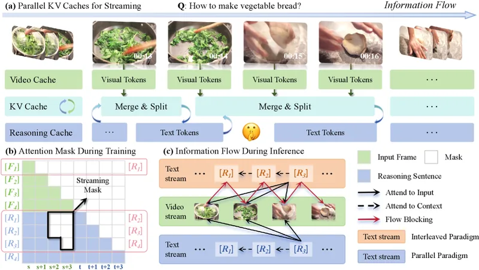
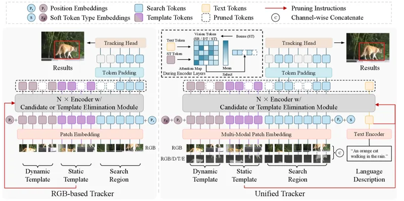
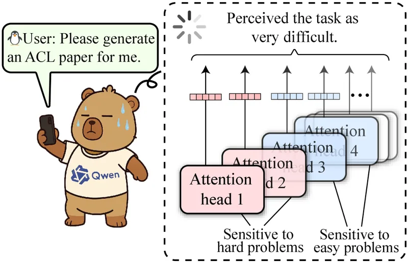
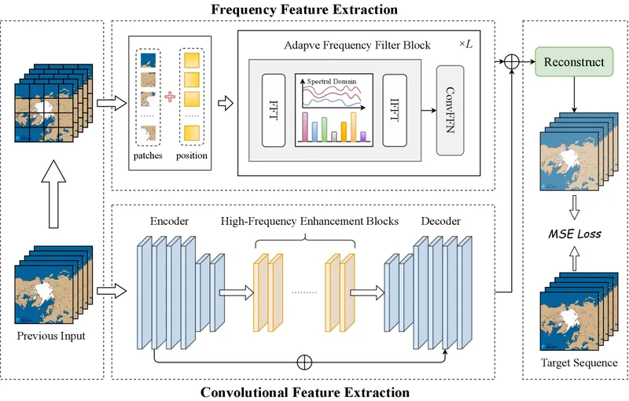

I am currently a Ph.D. student in Computing and Data Science at the School of Computing and Data Science, The University of Hong Kong (HKU), supervised by Prof. Y. Cao, continuing my research on AI for climate science and scientific forecasting. I received my M.S. degree in Software Engineering (Jul 2026) from Ocean University of China (OUC), where I worked with [Gao Feng](https://oucai.club/fenggao) in the [OUC AI Lab](https://oucai.club/), and my B.S. degree in Computer Science and Technology (Jun 2023) from OUC. From June to December 2025, I was a visiting scholar at Eastern Institute of Technology, Ningbo (EIT), under the supervision of [Xiaoyu Shen](https://faculty.eitech.edu.cn/cist/sxy/main.htm), focusing on Streaming Multimodal Large Models for video understanding.

My research interests encompass AI for Climate Science, Arctic sea ice prediction, scientific forecasting, and multimodal large language models (MLLMs), including streaming video reasoning and generative models. I have published some papers with total google scholar citations <a target="_self" href='https://scholar.google.com/citations?user=zk2uLXoAAAAJ' class="gs-badge-link">citations&hellip;</a>.

# 🔥 News
- _2026.09_: &nbsp;🎓 Started my Ph.D. at The University of Hong Kong (HKU)
- _2026.02_: &nbsp;🎉 Two papers were accepted in CVPR2026
- _2025.10_: &nbsp;🏆 China Graduate AI Innovation Competition, Third Class Prize
- _2025.12_: &nbsp;📅 Ended academic visit at EIT
- _2025.06_: &nbsp;👨‍💻Started academic visit at EIT
- _2025.04_: &nbsp;🎉 A paper was published in TGRS

# 📝 Publications

  

    
  

  

    
<a href="https://arxiv.org/abs/2603.02872">Think-as-You-See: Streaming Chain-of-Thought Reasoning for Large Vision-Language Models</a>

    <!-- 

 -->
    
CVPR, 2026

    
<strong>Jialiang Zhang</strong>, Junlong Tong, Junyan Lin, Hao Wu, Yirong Sun, Yunpu Ma, Xiaoyu Shen

    

  

  

    
  

  

    
<a href="https://arxiv.org/abs/2602.23734v1">UTPTrack: Towards Simple and Unified Token Pruning for Visual Tracking</a>

    <!-- 

 -->
    
CVPR, 2026

    
Hao Wu, Xudong Wang, <strong>Jialiang Zhang</strong>, Junlong Tong, Xinghao Chen, Junyan Lin, Yunpu Ma, Xiaoyu Shen

    

  

  

    
  

  

    
<a href="https://arxiv.org/abs/2510.05969">Probing the Difficulty Perception Mechanism of Large Language Models</a>

    <!-- 

 -->
    
arXiv Preprint

    
Sunbowen Lee, Qingyu Yin, Chak Tou Leong, <strong>Jialiang Zhang</strong>, Yicheng Gong, Xiaoyu Shen

    

  

  

    
  

  

    
<a href="https://arxiv.org/abs/2504.16745">Frequency-Compensated Network for Daily Arctic Sea Ice Concentration Prediction</a>

    <!-- 
  
 -->
    
IEEE Transactions on Geoscience and Remote Sensing (TGRS), 2025

    
<strong>Jialiang Zhang</strong>, Feng Gao, Yanhai Gan, Junyu Dong, Qian Du

    

  

# 🎖️Honors and Awards
- _2026_ SH Scholarship, The University of Hong Kong.
- _2026.04_ Graduate Science and Technology Innovation Scholarship.
- _2026.01_ Outstanding Graduate.
- _2025.10_ BYD Scholarship.
- _2025.10_ China Graduate AI Innovation Competition, Third Class Prize.
- _2024.12_ The 2nd Greater Bay Area AI For Science Technology Competition, Second Class Prize.
- _2024.09_ Outstanding Graduate Student Cadre of Ocean University of China.
- _2022_ ASC Student Supercomputer Challenge, Second Class Prize.
- _2022.11_ Outstanding Students of Ocean University of China.
- _2022.05_ Mathematical Contest In Modeling & Interdisciplinary Contest In Modeling(MCM/ICM) Honorable Mention.
- _2022.05_ Ocean University of China Third Class Scholarship.
- _2021.05_ Ocean University of China Third Class Scholarship.
- _2020.05_ Outstanding Youth League Member of Ocean University of China.

# 📖 Educations
- _2026.09 - (now)_, Ph.D. in Computing and Data Science, School of Computing and Data Science, The University of Hong Kong (HKU), supervised by Prof. Y. Cao, focusing on Machine Learning Fundamentals and AI for Climate Science.
- _2025.06 - 2025.12_, Visiting Scholar, Eastern Institute of Technology, Ningbo (EIT), supervised by Prof. Xiaoyu Shen, focusing on Streaming Multimodal Large Models for video understanding.
- _2023.08 - 2026.07_, M.S. in Software Engineering, Ocean University of China (OUC), supervised by Prof. Feng Gao, thesis on Arctic sea ice concentration prediction.
- _2019.09 - 2023.06_, B.S. in Computer Science and Technology, Ocean University of China (OUC).

# 🌍 Visitor Map

  

  

  <noscript>
The visitor map needs JavaScript. Raw data: <a href="data/visitor-map.json">data/visitor-map.json</a>
</noscript>

